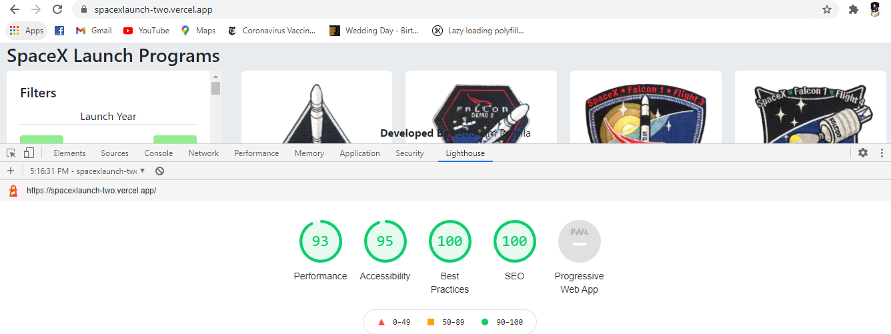

##
A front end application using Next JS React framework which provides server side rendering capabities. It provides users to browse all launches by SpaceX program.

Live demo - https://spacexlaunch-two.vercel.app/

### Setup

Run the following steps in order

```shell
$ npm install
$ npm run build
$ npm run start
```

### Description

At build time, the **getStaticProps** function inside index.js file will be called which fetches launch data via api call and passes it as props to Home component. Thus, the landing page html will be pre-rendered at build time as a static file which is served. This reduces the time required for initial page load to a great extent and also enables SEO.

### Features

- Server side rendering.
- Filter Panel to filter results based on launch year, launch success status & landing success status.
- Loading spinner on data loading.
- Responsive on desktops, tablets & mobile screens.


### Performance 

